# Jarkom-Modul-2-IT17-2024

##### Praktikum Jaringan Komputer Modul 2 Tahun 2024 - DNS dan Web Server

### Author
| Nama | NRP |
|---------|---------|
| Mutiara Nurhaliza | 5027221010   |
| Aqila Aqsa | 5027211032   |

#Laporan Resmi

- [Konfigurasi](topologi)
- [Nomor 1](soal-1)
- [Nomor 2](soal-2)
- [Nomor 3](soal-3)
- [Nomor 4](soal-4)
- [Nomor 5](soal-5)
- [Nomor 6](soal-6)
- [Nomor 7](soal-7)
- [Nomor 8](soal-8)
- [Nomor 9](soal-9)
- [Nomor 10](soal-10)
- [Nomor 11](soal-11)
- [Nomor 12](soal-12)
- [Nomor 13](soal-13)
- [Nomor 14](soal-14)
- [Nomor 15](soal-15)
- [Nomor 16](soal-16)
- [Nomor 17](soal-17)
- [Nomor 18](soal-18)
- [Nomor 19](soal-19)
- [Nomor 20](soal-20)

<a name="topologi"></a>
### Topologi
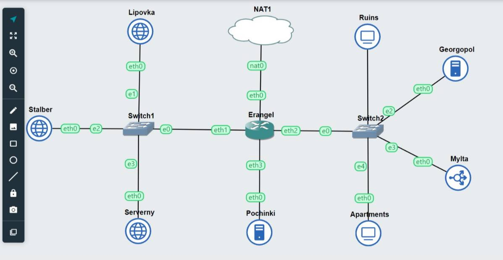

### Config
#### Erangel
```
 auto eth0
iface eth0 inet dhcp

auto eth1
iface eth1 inet static
	address 10.72.1.1
	netmask 255.255.255.0

auto eth2
iface eth2 inet static
	address 10.72.2.1
	netmask 255.255.255.0

auto eth3
iface eth3 inet static
	address 10.72.3.1
	netmask 255.255.255.0
```
#### Pocinki 
```
 auto eth0
iface eth0 inet static
	address 10.72.3.2
	netmask 255.255.255.0
	gateway 10.72.3.1
```

#### Serverny 
```
auto eth0
iface eth0 inet static
	address 10.72.1.4
	netmask 255.255.255.0
	gateway 10.72.1.1
```

#### Lipovka 
```
auto eth0
iface eth0 inet static
	address 10.72.1.2
	netmask 255.255.255.0
	gateway 10.72.1.1
```

#### Stalber 
```
auto eth0
iface eth0 inet static
	address 10.72.1.3
	netmask 255.255.255.0
	gateway 10.72.1.1
```
#### Ruins 
```
auto eth0
iface eth0 inet static
	address 10.72.2.2
	netmask 255.255.255.0
	gateway 10.72.2.1
```

#### Apartments 
```
auto eth0
iface eth0 inet static
	address 10.72.2.5
	netmask 255.255.255.0
	gateway 10.72.2.1
```

#### Georgopol 
```
auto eth0
iface eth0 inet static
	address 10.72.2.3
	netmask 255.255.255.0
	gateway 10.72.2.1
```

#### Mylta 
```
auto eth0
iface eth0 inet static
	address 10.72.2.4
	netmask 255.255.255.0
	gateway 10.72.2.1
```

### Inisiasi .bashrc 

#### Erangel
```
iptables -t nat -A POSTROUTING -o eth0 -j MASQUERADE -s 192.173.0.0/16
echo 'nameserver 192.168.122.1' > /etc/resolv.conf
```
#### Pochinki & Georgopol
```
echo 'nameserver 192.168.122.1' > /etc/resolv.conf
apt-get update
apt-get install bind9 -y      
```
#### Client
```
echo -e '
nameserver 10.72.3.2 
nameserver 10.72.2.3 
nameserver 192.168.122.1
' > /etc/resolv.conf
apt-get update
apt-get install dnsutils -y
apt-get install lynx -y
```

<a name="soal-1"></a>
### Soal 1

Membuat jaringan komputer yang akan digunakan sebagai alat komunikasi. Sesuaikan rancangan Topologi dengan rancangan dan pembagian yang berada di link yang telah disediakan, dengan ketentuan nodenya sebagai berikut :
DNS Master akan diberi nama Pochinki, sesuai dengan kota tempat dibuatnya server tersebut
Karena ada kemungkinan musuh akan mencoba menyerang Server Utama, maka buatlah DNS Slave Georgopol yang mengarah ke Pochinki
Markas pusat juga meminta dibuatkan tiga Web Server yaitu Severny, Stalber, dan Lipovka. Sedangkan Mylta akan bertindak sebagai Load Balancer untuk server-server tersebut

Melakukan setup IP dan configurasi yang tertera diatas terlebih dahulu. Kemudian, melakukan testing client Apartments dan Ruins

#### Script

```
ping google.com -c 5
```
#### Output

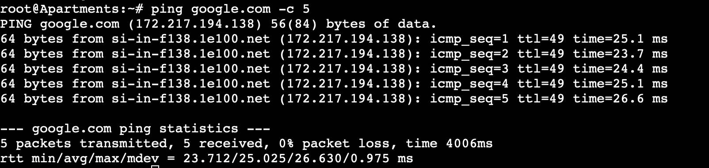
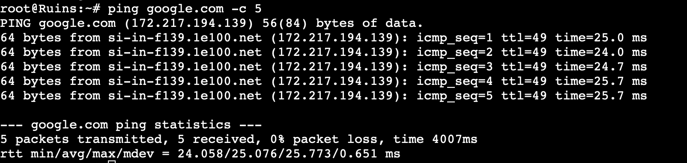

<a name="soal-2"></a>
### Soal 2

Karena para pasukan membutuhkan koordinasi untuk mengambil airdrop, maka buatlah sebuah domain yang mengarah ke Stalber dengan alamat airdrop.xxxx.com dengan alias www.airdrop.xxxx.com dimana xxxx merupakan kode kelompok. Contoh : airdrop.it01.com

#### Script

```
echo 'zone "airdrop.IT17.com" {
        type master;
        file "/etc/bind/jarkom/airdrop.IT17.com";
};' > /etc/bind/named.conf.local

mkdir /etc/bind/jarkom

cp /etc/bind/db.local /etc/bind/jarkom/airdrop.IT17.com

echo '
;
; BIND data file for local loopback interface
;
$TTL    604800
@       IN      SOA     airdrop.IT17.com. root.airdrop.IT17.com. (
                        2024050301      ; Serial
                         604800         ; Refresh
                          86400         ; Retry
                        2419200         ; Expire
                         604800 )       ; Negative Cache TTL
;
@       IN      NS      airdrop.IT17.com.
@       IN      A       10.72.1.3
www     IN      CNAME   airdrop.IT17.com.' > /etc/bind/jarkom/airdrop.IT17.com

service bind9 restart
```
#### Output
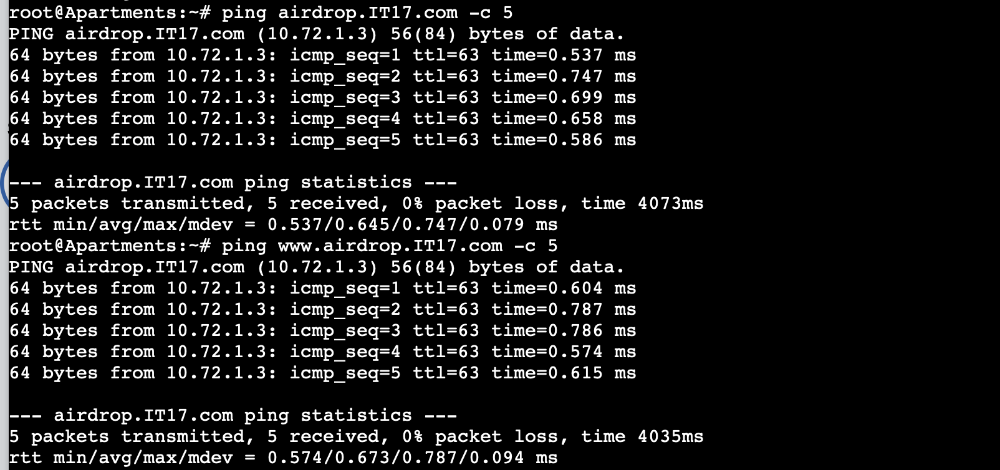
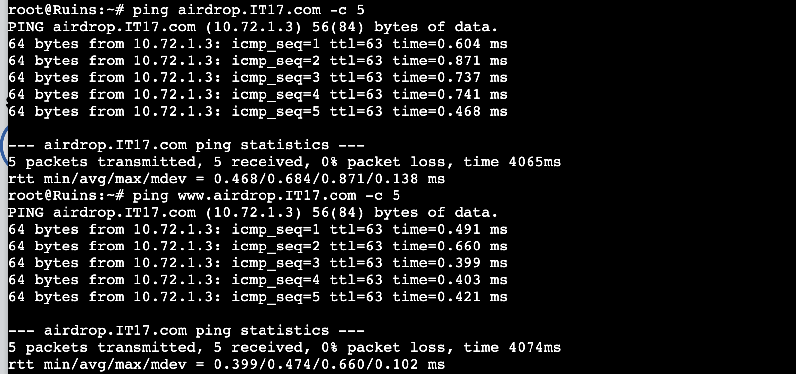

<a name="soal-3"></a>
### Soal 3

Para pasukan juga perlu mengetahui mana titik yang sedang di bombardir artileri, sehingga dibutuhkan domain lain yaitu redzone.xxxx.com dengan alias www.redzone.xxxx.com yang mengarah ke Severny


#### Script

```
echo 'zone "redzone.IT17.com" {
        type master;
        file "/etc/bind/jarkom/redzone.IT17.com";
};' > /etc/bind/named.conf.local

cp /etc/bind/db.local /etc/bind/jarkom/redzone.IT17.com

echo ' 
;
; BIND data file for local loopback interface
;
$TTL    604800
@       IN      SOA     redzone.IT17.com. root.redzone.IT17.com. (
                        2024050301      ; Serial
                         604800         ; Refresh
                          86400         ; Retry
                        2419200         ; Expire
                         604800 )       ; Negative Cache TTL
;
@       IN      NS      redzone.IT17.com.
@       IN      A       10.72.1.4
www     IN      CNAME   redzone.IT17.com.' > /etc/bind/jarkom/redzone.IT17.com

service bind9 restart
```
#### Output
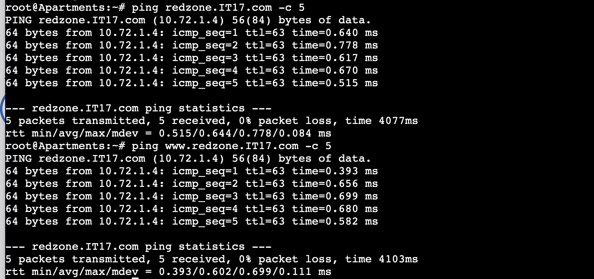
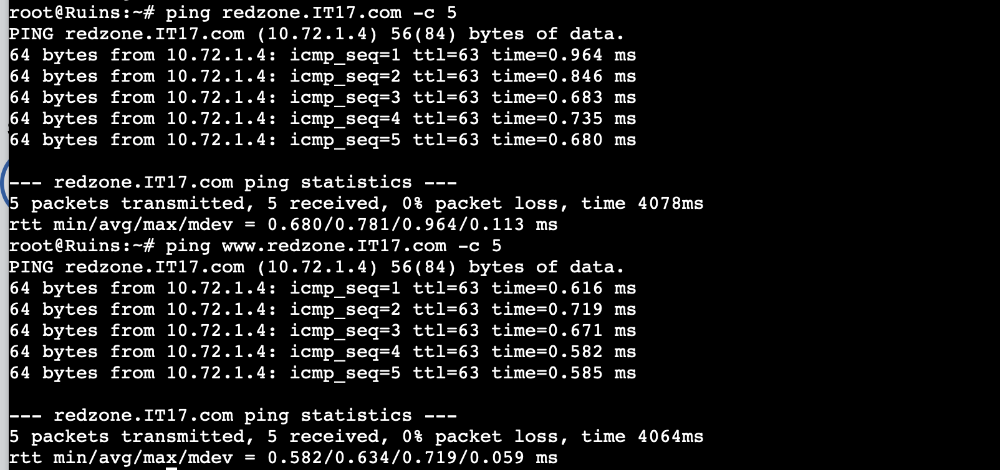

<a name="soal-4"></a>
### Soal 4

Markas pusat meminta dibuatnya domain khusus untuk menaruh informasi persenjataan dan suplai yang tersebar. Informasi persenjataan dan suplai tersebut mengarah ke Mylta dan domain yang ingin digunakan adalah loot.xxxx.com dengan alias www.loot.xxxx.com


#### Script

```
echo 'zone "loot.IT17.com" {
        type master;
        file "/etc/bind/jarkom/loot.IT17.com";
};' >> /etc/bind/named.conf.local

cp /etc/bind/db.local /etc/bind/jarkom/loot.IT17.com

echo ' 
;
; BIND data file for local loopback interface
;
$TTL    604800
@       IN      SOA     loot.IT17.com. root.loot.IT17.com. (
                        2024050301      ; Serial
                         604800         ; Refresh
                          86400         ; Retry
                        2419200         ; Expire
                         604800 )       ; Negative Cache TTL
;
@       IN      NS      loot.IT17.com.
@       IN      A       10.72.2.4
www     IN      CNAME   loot.IT17.com.' > /etc/bind/jarkom/loot.IT17.com

service bind9 restart
```
#### Output

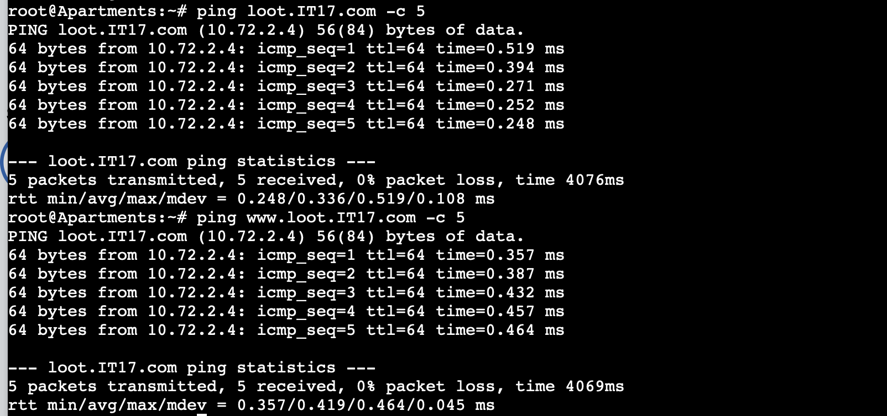

<a name="soal-5"></a>
### Soal 5

Markas pusat meminta dibuatnya domain khusus untuk menaruh informasi persenjataan dan suplai yang tersebar. Informasi persenjataan dan suplai tersebut mengarah ke Mylta dan domain yang ingin digunakan adalah loot.xxxx.com dengan alias www.loot.xxxx.com 

#### Script

Dapat dilihat pada nomor 2, 3, dan 4

#### Output

Dapat dilihat pada nomor 2, 3, dan 4

<a name="soal-6"></a>
### Soal 6

Beberapa daerah memiliki keterbatasan yang menyebabkan hanya dapat mengakses domain secara langsung melalui alamat IP domain tersebut. Karena daerah tersebut tidak diketahui secara spesifik, pastikan semua komputer (client) dapat mengakses domain redzone.xxxx.com melalui alamat IP Severny (Notes : menggunakan pointer record)

### Script

```bash
echo 'zone "1.72.10.in-addr.arpa" {
    type master;
    file "/etc/bind/jarkom/1.72.10.in-addr.arpa";
};' >> /etc/bind/named.conf.local

mkdir -p /etc/bind/jarkom

cp /etc/bind/db.local /etc/bind/jarkom/1.72.10.in-addr.arpa

echo ';
; BIND data file for local loopback interface
;
$TTL    604800
@       IN      SOA     redzone.IT17.com. root.redzone.IT17.com. (
                              2         ; Serial
                         604800         ; Refresh
                          86400         ; Retry
                        2419200         ; Expire
                         604800 )       ; Negative Cache TTL
;
1.72.10.in-addr.arpa.   IN      NS      redzone.IT17.com.
4                       IN      PTR     redzone.IT17.com.
' > /etc/bind/jarkom/1.72.10.in-addr.arpa

service bind9 restart
```

- Masukkan reverse dari 3 byte awal IP Severny (10.72.1.4) -> 1.72.10 ke dalam /etc/bind/named.conf.local
- Buat dir /etc/bind/jarkom
- Copy db.local ke /etc/bind/jarkom/1.72.10.in-addr.arpa
- Edit config seperti di script

### Testing

#### Script
```bash
echo nameserver 192.168.122.1 > /etc/resolv.conf #IP Erangel

apt-get update
apt-get install dnsutils

echo nameserver 10.72.3.2 > /etc/resolv.conf #IP Pochinki
```
Ketikkan `host -t PTR 10.72.1.4` (IP Severny) pada terminal.

#### Output
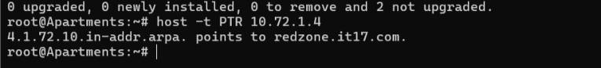

<a name="soal-7"></a>
### Soal 7

Akhir-akhir ini seringkali terjadi serangan siber ke DNS Server Utama, sebagai tindakan antisipasi kamu diperintahkan untuk membuat DNS Slave di Georgopol untuk semua domain yang sudah dibuat sebelumnya


#### Script

##### Pochinki
```
echo 'zone "airdrop.IT17.com" {
        type master;
        file "/etc/bind/jarkom/airdrop.IT17.com";
        allow-transfer { 10.72.2.3; };
        also-notify { 10.72.2.3; };
};' > /etc/bind/named.conf.local


echo 'zone "redzone.IT17.com" {
        type master;
        file "/etc/bind/jarkom/redzone.IT17.com";
        also-notify { 10.72.2.3; };
        allow-transfer { 10.72.2.3; };

};' >> /etc/bind/named.conf.local

echo 'zone "loot.IT17.com" {
        type master;
        file "/etc/bind/jarkom/loot.IT17.com";
        also-notify { 10.72.2.3; };
        allow-transfer { 10.72.2.3; }; 
   
};' >>/etc/bind/named.conf.local
```
##### Georgopol
```
echo 'zone "airdrop.IT17.com" {
    type slave;
    masters { 10.72.3.2; }; // Masukan IP EniesLobby tanpa tanda petik
    file "/var/lib/bind/airdrop.IT17.com";
};

zone "redzone.IT17.com" {
    type slave;
    masters { 10.72.3.2; }; // Masukan IP EniesLobby tanpa tanda petik
    file "/var/lib/bind/redzone.IT17.com";
};

zone "loot.IT17.com" {
    type slave;
    masters { 10.72.3.2; }; // Masukan IP EniesLobby tanpa tanda petik
    file "/var/lib/bind/loot.IT17.com";
};'  > /etc/bind/named.conf.local

```
#### Output
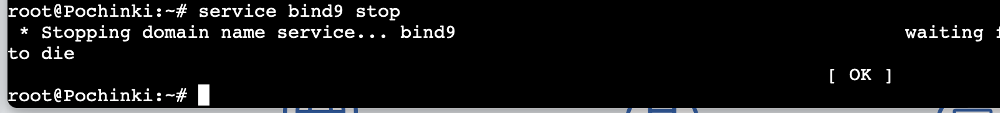
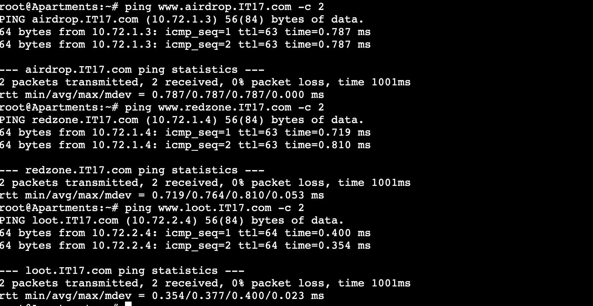
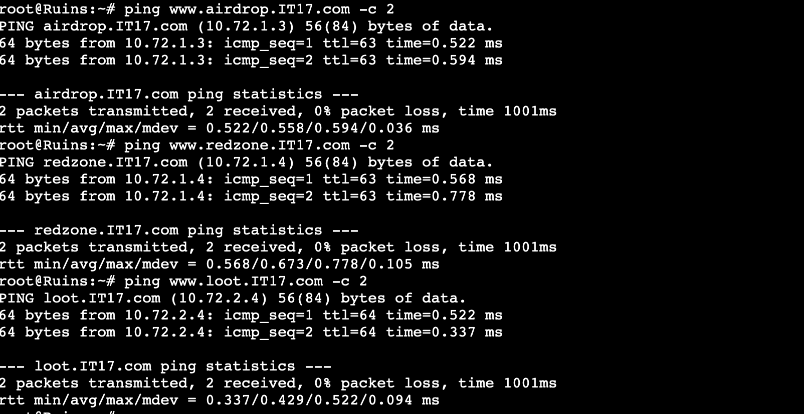

<a name="soal-8"></a>
### Soal 8

Kamu juga diperintahkan untuk membuat subdomain khusus melacak airdrop berisi peralatan medis dengan subdomain medkit.airdrop.xxxx.com yang mengarah ke Lipovka


#### Script

```
echo '
;
; BIND data file for local loopback interface
;
$TTL    604800
@       IN      SOA     airdrop.IT17.com. root.airdrop.IT17.com. (
                        2023101001      ; Serial
                         604800         ; Refresh
                          86400         ; Retry
                        2419200         ; Expire
                         604800 )       ; Negative Cache TTL
;
@       IN      NS      airdrop.IT17.com.
@       IN      A       10.72.1.3   ; 
www     IN      CNAME   airdrop.IT17.com.
medkit  IN      A       10.72.1.2     ;' > /etc/bind/jarkom/airdrop.IT17.com

service bind9 restart
```
#### Output
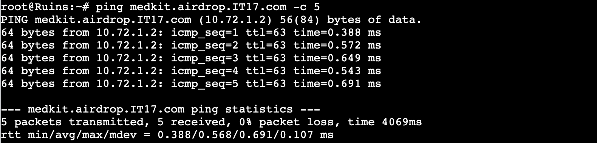
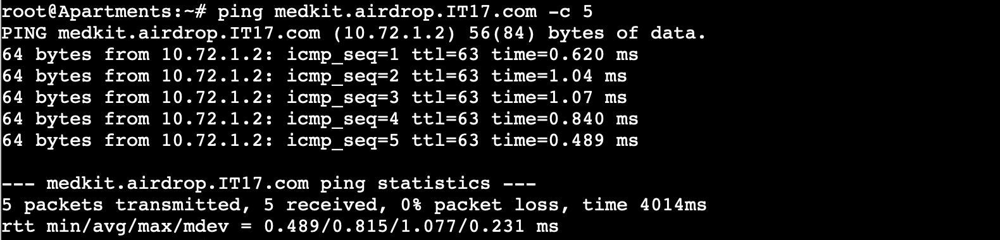

<a name="soal-9"></a>
### Soal 9

Terkadang red zone yang pada umumnya di bombardir artileri akan dijatuhi bom oleh pesawat tempur. Untuk melindungi warga, kita diperlukan untuk membuat sistem peringatan air raid dan memasukkannya ke subdomain siren.redzone.xxxx.com dalam folder siren dan pastikan dapat diakses secara mudah dengan menambahkan alias www.siren.redzone.xxxx.com dan mendelegasikan subdomain tersebut ke Georgopol dengan alamat IP menuju radar di Severny


#### Script
##### Pochinki

```
echo ';
; BIND data file for local loopback interface
;
$TTL    604800
@       IN      SOA     redzone.IT17.com. root.redzone.IT17.com. (
                        2023101001      ; Serial
                         604800         ; Refresh
                          86400         ; Retry
                        2419200         ; Expire
                         604800 )       ; Negative Cache TTL
;
@       IN      NS      redzone.IT17.com.
@       IN      A       10.72.1.4
www     IN      CNAME   redzone.IT17.com.
ns1     IN      A       10.72.2.3     ; IP georgopol
siren   IN      NS      ns1' > /etc/bind/jarkom/redzone.IT17.com


echo "options {
    directory \"/var/cache/bind\";

    // If there is a firewall between you and nameservers you want
    // to talk to, you may need to fix the firewall to allow multiple
    // ports to talk.  See http://www.kb.cert.org/vuls/id/800113

    // If your ISP provided one or more IP addresses for stable
    // nameservers, you probably want to use them as forwarders.
    // Uncomment the following block, and insert the addresses replacing
    // the all-0's placeholder.  
    // };

    //========================================================================
    // If BIND logs error messages about the root key being expired,
    // you will need to update your keys.  See https://www.isc.org/bind-keys
    //========================================================================
    //dnssec-validation auto;

    allow-query { any; };
    auth-nxdomain no;
    listen-on-v6 { any; };
};" > /etc/bind/named.conf.options

service bind9 restart
```
##### Georgopol
```
echo "
options {
        directory \"/var/cache/bind\";
        allow-query{any;};
        auth-nxdomain no;    # conform to RFC1035
        listen-on-v6 { any; };
};
" > /etc/bind/named.conf.options

echo '

zone "siren.redzone.IT17.com"{
        type master;
        file "/etc/bind/siren/siren.redzone.IT17.com";
};
'>> /etc/bind/named.conf.local

mkdir /etc/bind/siren

echo "
\$TTL    604800
@       IN      SOA     siren.redzone.IT17.com. root.siren.redzone.IT17.com. (
                        2021100401      ; Serial
                        604800         ; Refresh
                        86400         ; Retry
                        2419200         ; Expire
                        604800 )       ; Negative Cache TTL
;
@               IN      NS      siren.redzone.IT17.com.
@               IN      A       10.72.1.4       ;ip skypie
www             IN      CNAME   siren.redzone.IT17.com.
" > /etc/bind/siren/siren.redzone.IT17.com
service bind9 restart
```

#### Output
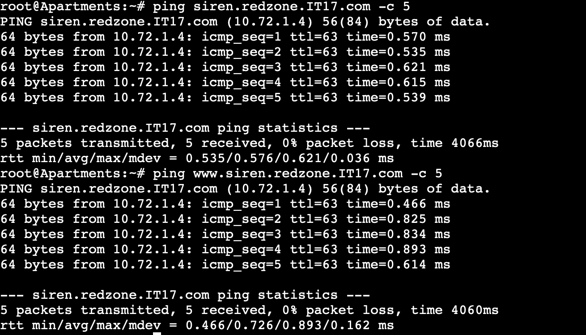
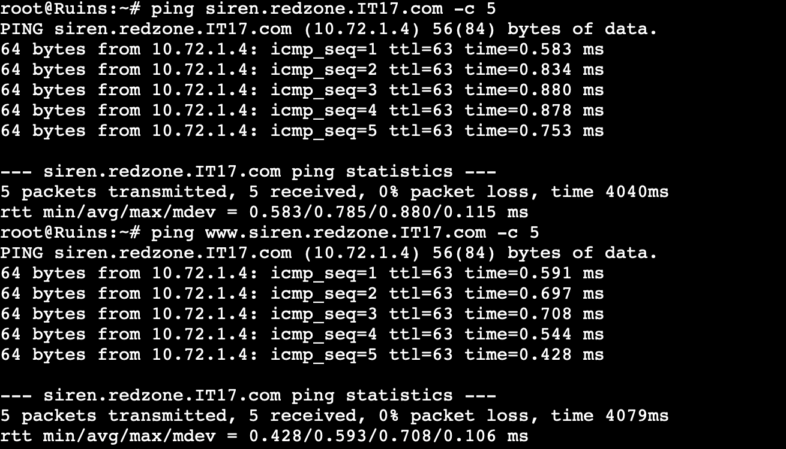

<a name="soal-10"></a>
### Soal 10

Markas juga meminta catatan kapan saja pesawat tempur tersebut menjatuhkan bom, maka buatlah subdomain baru di subdomain siren yaitu log.siren.redzone.xxxx.com serta aliasnya www.log.siren.redzone.xxxx.com yang juga mengarah ke Severny


#### Script
##### Georgopol

```
echo "
\$TTL    604800
@       IN      SOA     siren.redzone.IT17.com. root.siren.redzone.IT17.com. (
                        2021100401      ; Serial
                        604800         ; Refresh
                        86400         ; Retry
                        2419200         ; Expire
                        604800 )       ; Negative Cache TTL
;
@               IN      NS      siren.redzone.IT17.com.
@               IN      A       10.72.1.4       ;
www             IN      CNAME   siren.redzone.IT17.com.
log             IN      A       10.72.1.4      ; 
www.log         IN      CNAME   log.siren.redzone.IT17.com." > /etc/bind/siren/siren.redzone.IT17.com
service bind9 restart
```

#### Output
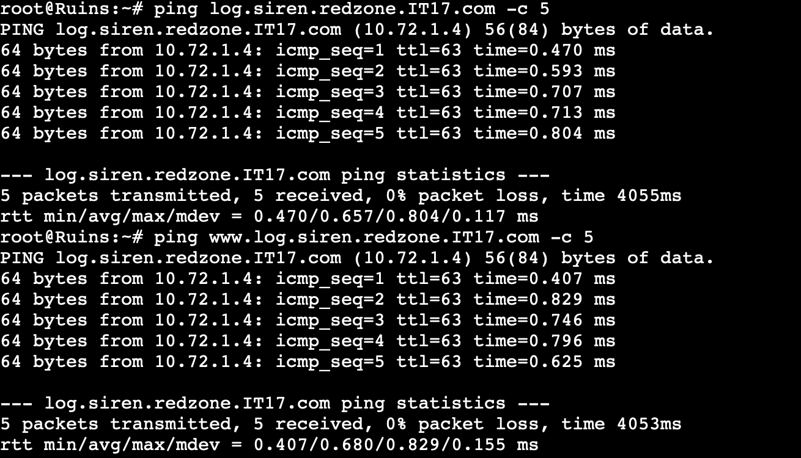
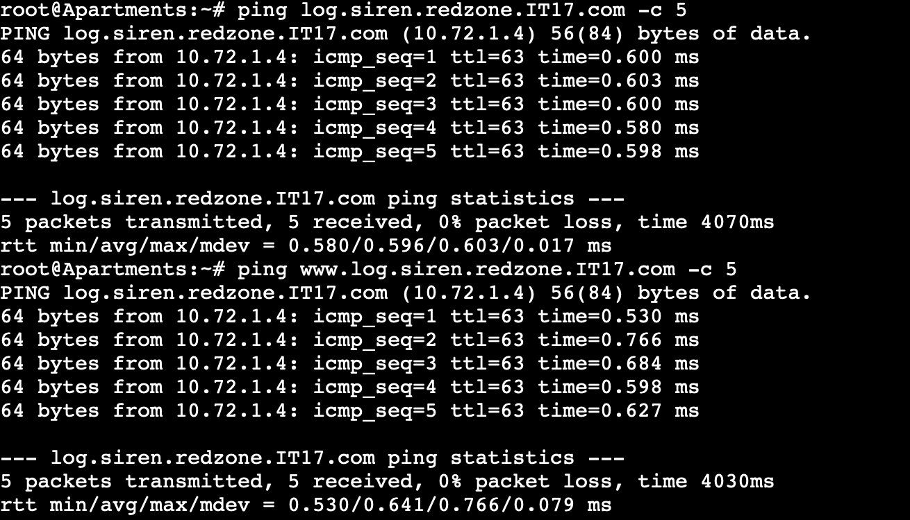

<a name="soal-11"></a>
### Soal 11
Setelah pertempuran mereda, warga Erangel dapat kembali mengakses jaringan luar, tetapi hanya warga Pochinki saja yang dapat mengakses jaringan luar secara langsung. Buatlah konfigurasi agar warga Erangel yang berada diluar Pochinki dapat mengakses jaringan luar melalui DNS Server Pochinki

#### Script
```bash
echo 'options {
    directory "/var/cache/bind";

    // If there is a firewall between you and nameservers you want
    // to talk to, you may need to fix the firewall to allow multiple
    // ports to talk.  See http://www.kb.cert.org/vuls/id/800113

    // If your ISP provided one or more IP addresses for stable
    // nameservers, you probably want to use them as forwarders.
    // Uncomment the following block, and insert the addresses replacing
    // the all-0s placeholder.
    forwarders {
        192.168.122.1;
    };

    //========================================================================
    // If BIND logs error messages about the root key being expired,
    // you will need to update your keys.  See https://www.isc.org/bind-keys
    //========================================================================
    //dnssec-validation auto;

    allow-query { any; };
    auth-nxdomain no;
    listen-on-v6 { any; };
};' > /etc/bind/named.conf.options

service bind9 restart
```

### Testing

Masukkan nameserver IP Pochinki (10.72.3.2) pada salah satu client dengan `nano /etc/resolv.conf`, seharusnya bisa akses ker jaringan luar. 

#### Output

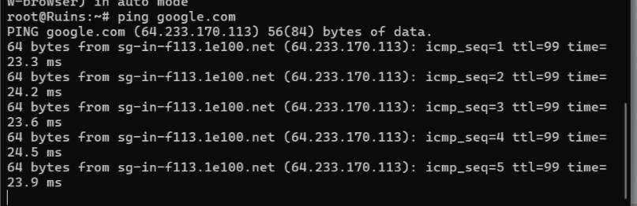
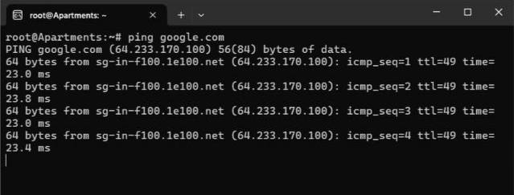

<a name="soal-12"></a>
### Soal 12

Karena pusat ingin sebuah website yang ingin digunakan untuk memantau kondisi markas lainnya maka deploy lah webiste ini (cek resource yg lb) pada severny menggunakan apache


#### Script
##### Serverny

```
service apache2 restart
service apache2 status

echo '
<VirtualHost *:80>
    ServerAdmin webmaster@localhost
    DocumentRoot /var/www/html/severny
    ErrorLog ${APACHE_LOG_DIR}/error.log
    CustomLog ${APACHE_LOG_DIR}/access.log combined
</VirtualHost>
' > /etc/apache2/sites-available/000-default.conf

mkdir -p /var/www/html/severny

echo '
<?php
$hostname = gethostname();
$date = date('Y-m-d H:i:s');
$php_version = phpversion();
$username = get_current_user();


echo "Hello World!<br>";
echo "Saya adalah: $username<br>";
echo "Saat ini berada di: $hostname<br>";
echo "Versi PHP yang saya gunakan: $php_version<br>";
echo "Tanggal saat ini: $date<br>";
?>
' > /var/www/html/severny/index.php
```

#### Output
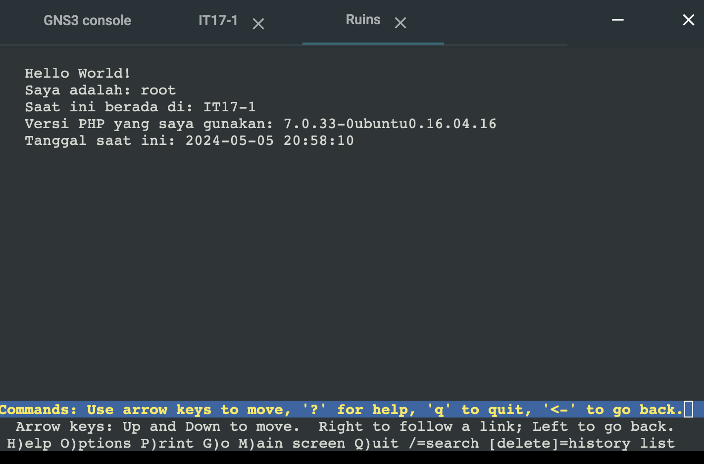

<a name="soal-13"></a>
### Soal 13

Tapi pusat merasa tidak puas dengan performanya karena traffic yag tinggi maka pusat meminta kita memasang load balancer pada web nya, dengan Severny, Stalber, Lipovka sebagai worker dan Mylta sebagai Load Balancer menggunakan apache sebagai web server nya dan load balancernya


#### Script
##### Mylta

```
service apache2 start
a2enmod proxy
a2enmod proxy_http
a2enmod proxy_balancer
a2enmod lbmethod_byrequests

service apache2 restart
service apache2 status

echo '<VirtualHost *:80>
   <Proxy balancer://mycluster>
BalancerMember http://10.72.1.4:80
BalancerMember http://10.72.1.2:80
      BalancerMember http://10.72.1.3:80
    </Proxy>
    ProxyPreserveHost On
    ProxyPass / balancer://mycluster/
    ProxyPassReverse / balancer://mycluster/
</VirtualHost>' >/etc/apache2/sites-available/000-default.conf

service apache2 restart
service apache2 status
service apache2 start

```

##### Stalber

```
service apache2 restart
service apache2 status

echo '
<VirtualHost *:80>
    ServerAdmin webmaster@localhost
    DocumentRoot /var/www/html/stalber
    ErrorLog ${APACHE_LOG_DIR}/error.log
    CustomLog ${APACHE_LOG_DIR}/access.log combined
</VirtualHost>
' > /etc/apache2/sites-available/000-default.conf

mkdir -p /var/www/html/stalber

echo '
<?php
$hostname = gethostname();
$date = date('Y-m-d H:i:s');
$php_version = phpversion();
$username = get_current_user();


echo "Hello World!<br>";
echo "Saya adalah: $username<br>";
echo "Saat ini berada di: $hostname<br>";
echo "Versi PHP yang saya gunakan: $php_version<br>";
echo "Tanggal saat ini: $date<br>";
?>
' > /var/www/html/stalber/index.php
```

##### Serverny

```
service apache2 restart
service apache2 status

echo '
<VirtualHost *:80>
    ServerAdmin webmaster@localhost
    DocumentRoot /var/www/html/serverny
    ErrorLog ${APACHE_LOG_DIR}/error.log
    CustomLog ${APACHE_LOG_DIR}/access.log combined
</VirtualHost>
' > /etc/apache2/sites-available/000-default.conf

mkdir -p /var/www/html/serverny

echo '
<?php
$hostname = gethostname();
$date = date('Y-m-d H:i:s');
$php_version = phpversion();
$username = get_current_user();


echo "Hello World!<br>";
echo "Saya adalah: $username<br>";
echo "Saat ini berada di: $hostname<br>";
echo "Versi PHP yang saya gunakan: $php_version<br>";
echo "Tanggal saat ini: $date<br>";
?>
' > /var/www/html/serverny/index.php
```
##### Lipovka

```
service apache2 restart
service apache2 status

echo '
<VirtualHost *:80>
    ServerAdmin webmaster@localhost
    DocumentRoot /var/www/html/lipovka
    ErrorLog ${APACHE_LOG_DIR}/error.log
    CustomLog ${APACHE_LOG_DIR}/access.log combined
</VirtualHost>
' > /etc/apache2/sites-available/000-default.conf

mkdir -p /var/www/html/lipovka

echo '
<?php
$hostname = gethostname();
$date = date('Y-m-d H:i:s');
$php_version = phpversion();
$username = get_current_user();


echo "Hello World!<br>";
echo "Saya adalah: $username<br>";
echo "Saat ini berada di: $hostname<br>";
echo "Versi PHP yang saya gunakan: $php_version<br>";
echo "Tanggal saat ini: $date<br>";
?>
' > /var/www/html/lipovka/index.php
```
#### Output
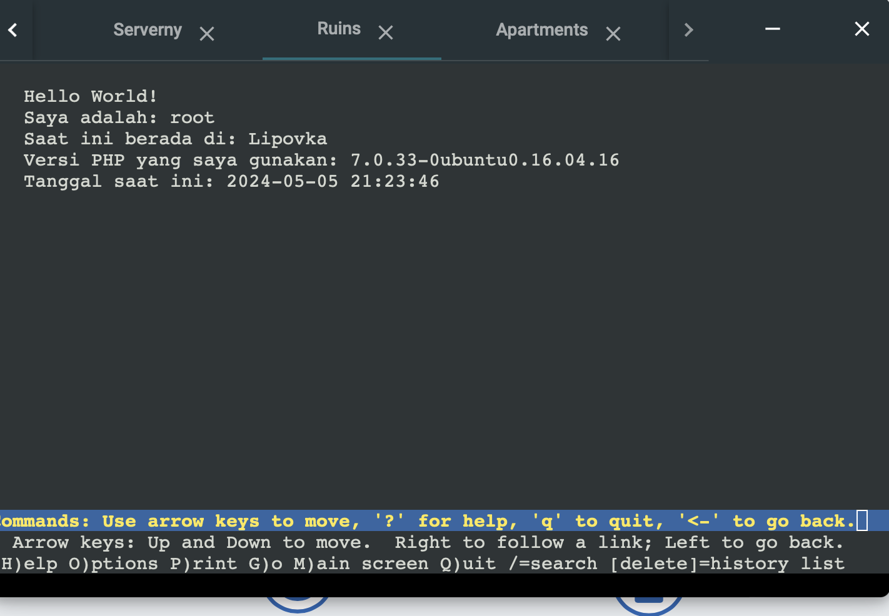
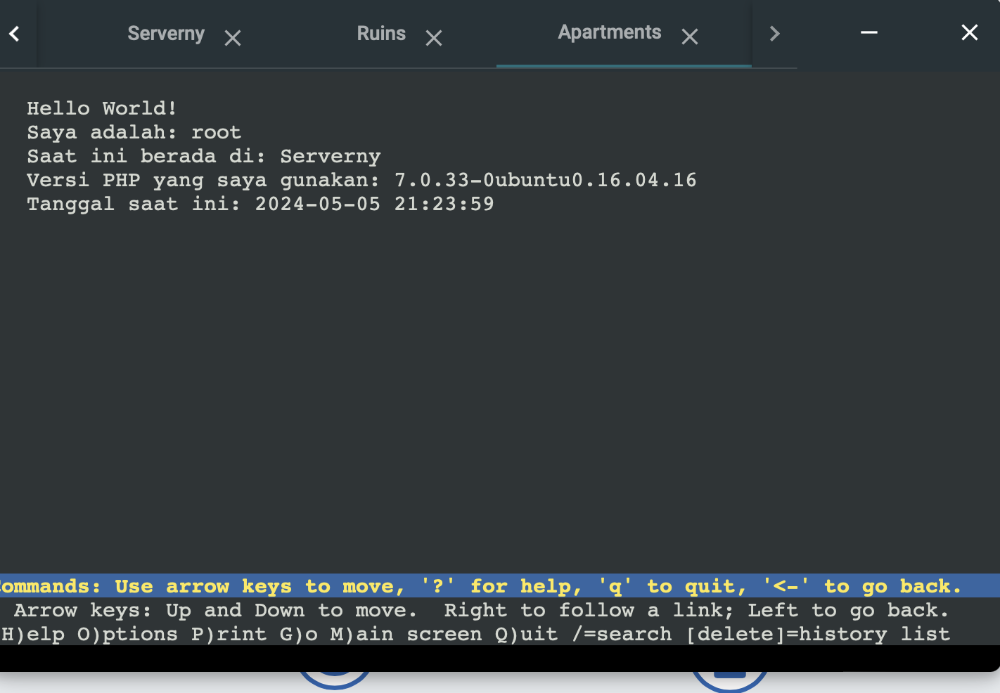

<a name="soal-14"></a>
### Soal 14